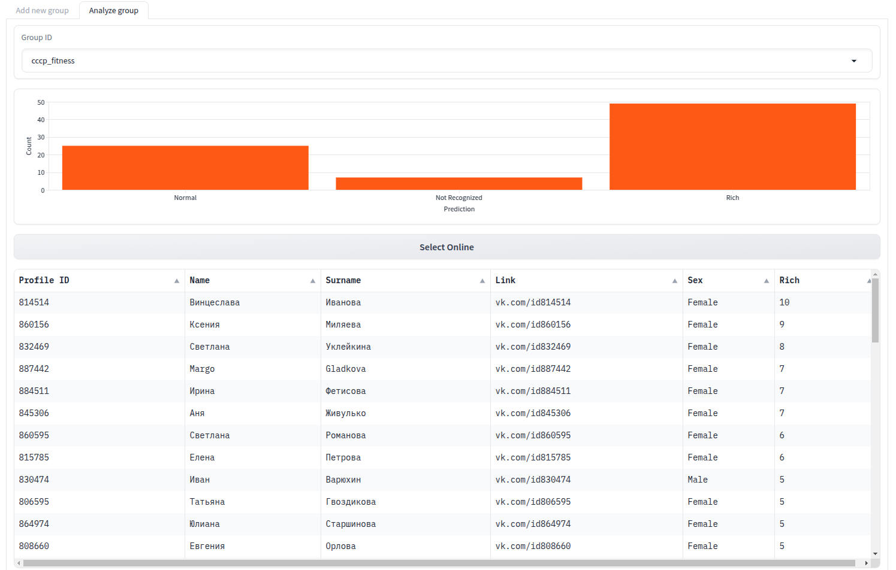
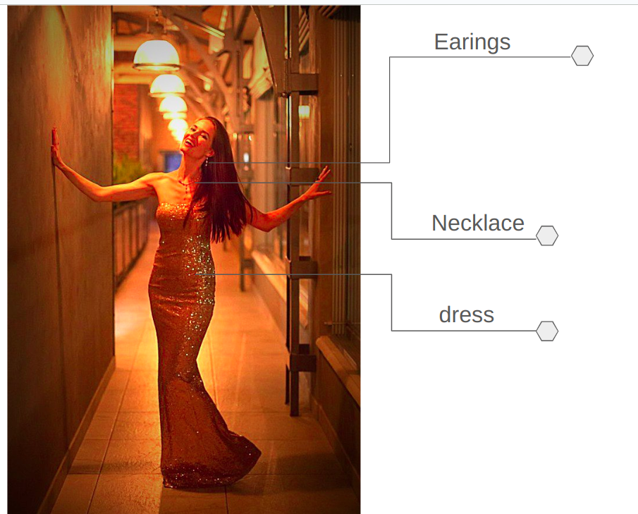
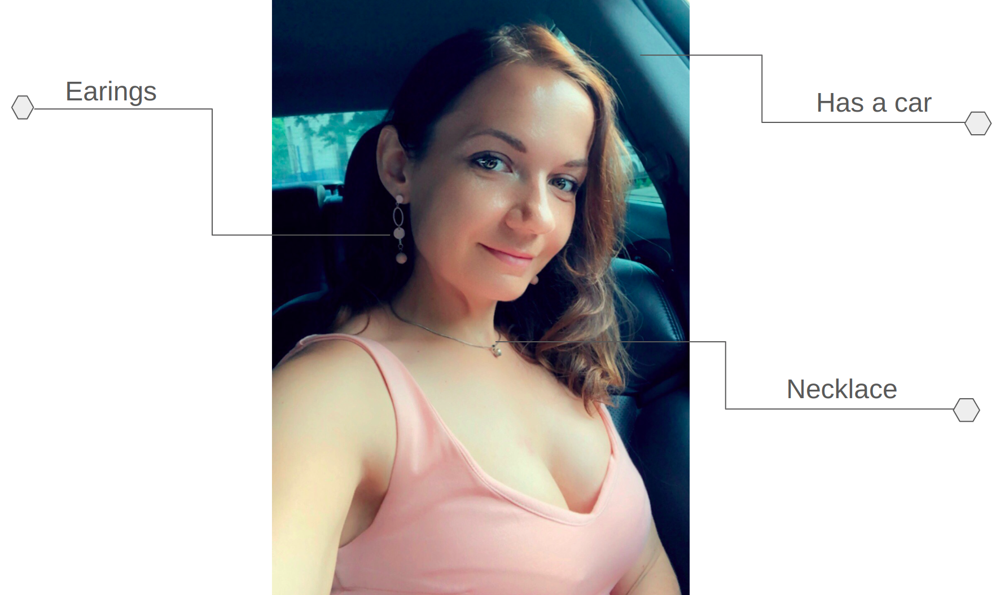

# People-Analysis
A web application for analyzing people's economical status of VK profiles.
## Interface

 

**Steps:**
 
-> Add a group name  
-> Get statistics of the number of rich people in the group  
-> Get rating for every user based on his economical status (how rich he is)  

**Criteria for rating:**
 
`wearing expensive clothes` (dress, suits),  
`wearing expensive watches`,  
`wearing expensive jewelry`,  
`having a car`, (sitting in a car)  

## Results

